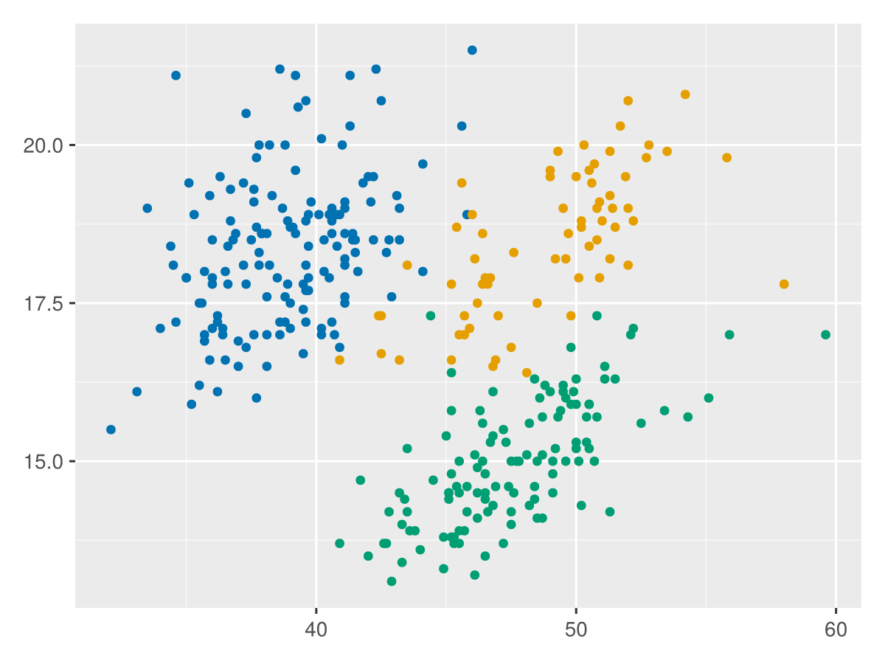
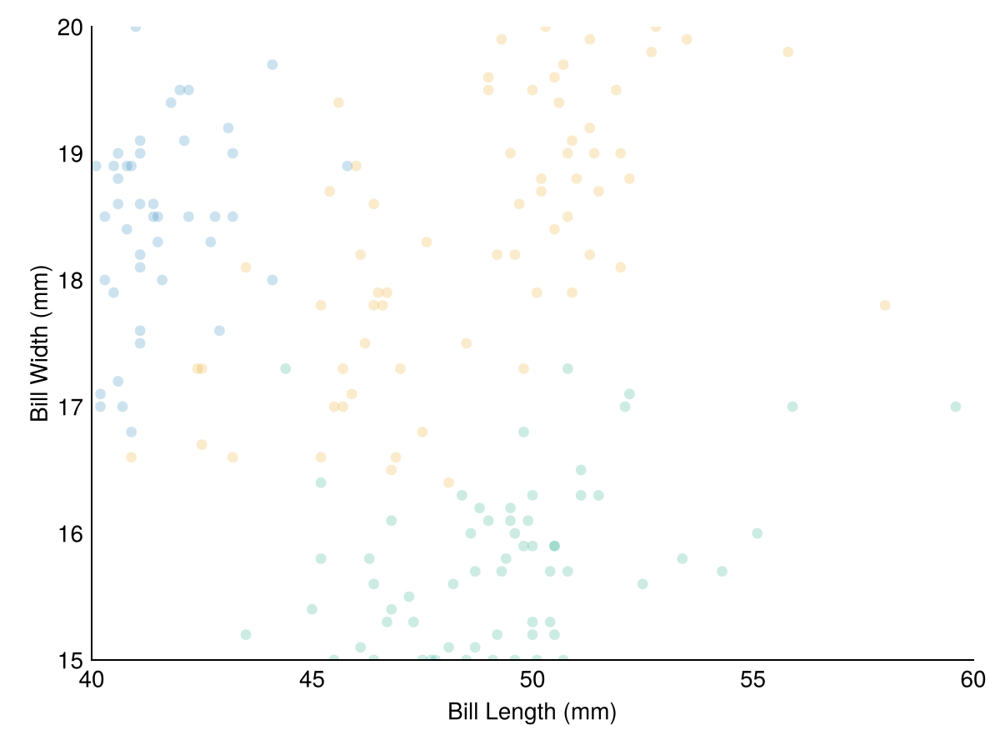

# From data to plots {#From-data-to-plots}

## Exploring the penguins data {#Exploring-the-penguins-data}

A very well known dataset in the R community is the `palmerpenguins` dataset. It contains data about penguins, including their species and some ecological measurements. Let&#39;s load the data and take a look at it.

```julia
using Tidier #exports TidierPlots.jl and others
using DataFrames
using PalmerPenguins

penguins = dropmissing(DataFrame(PalmerPenguins.load()));
```


The `penguins` DataFrame contains the following columns (from `TiderData.jl` let us take a glimpse):

```julia
@glimpse penguins
```


```
Rows: 333
Columns: 7
.species        InlineStrings.String15Adelie, Adelie, Adelie, Adelie, Adelie, Ade
.island         InlineStrings.String15Torgersen, Torgersen, Torgersen, Torgersen,
.bill_length_mm Float64        39.1, 39.5, 40.3, 36.7, 39.3, 38.9, 39.2, 41.1, 38
.bill_depth_mm  Float64        18.7, 17.4, 18.0, 19.3, 20.6, 17.8, 19.6, 17.6, 21
.flipper_length _mmInt64          181, 186, 195, 193, 190, 181, 195, 182, 191, 19
.body_mass_g    Int64          3750, 3800, 3250, 3450, 3650, 3625, 4675, 3200, 38
.sex            InlineStrings.String7male, female, female, female, male, female,
```


## A simple `TiderPlots.jl` scatterplot {#A-simple-TiderPlots.jl-scatterplot}

Now the experience to plot using `TidierPlots.jl` will be as seamless as in R. Let&#39;s start by plotting the `bill_length_mm` and `bill_depth_mm` columns.

```julia
ggplot(penguins, @aes(x=bill_length_mm, y=bill_depth_mm, color = species))+
    geom_point()
```





This is _not_ R code, its pure Julia. And if you are familiar with R, you will find it very similar. The `ggplot` function creates a plot object, and the `geom_point` function adds a scatter layer on top of it. The `@aes` macro is used to map the variables of the `penguins` DataFrame to the aesthetics of the plot. In this case, we are mapping the `bill_length_mm` column to the x-axis, the `bill_depth_mm` column to the y-axis, and the `species` column to the color of the points. The output is a scatter plot of the `bill_length_mm` and `bill_depth_mm` columns, colored by the `species` column.

Now, `@aes()` is used to map variables in your data to visual properties (aesthetics) of the plot. These aesthetics can include things like position (x and y coordinates), color, shape, size, etc. Each aesthetic is a way of visualizing a variable or a statistical transformation of a variable.

Aesthetics are specified in the form aes(aesthetic = variable), where aesthetic is the name of the aesthetic, and variable is the column name in your data that you want to map to the aesthetic. The variable names do not need to be preceded by a colon. This is the first difference you might encounter when using `TidierPlots.jl`, and the best part is that it also accepts multiple forms for `aes` specification, none of which is exactly the same as ggplot2.

Option 1: `@aes` macro, aes as in ggplot2:

```julia
@aes(x = x, y = y)
```


Option 2: `@es`:

```julia
@es(x = x, y = y)
```


Option 3: `aes` function, julia-style columns:

```julia
aes(x = :x, y = :y)
```


Option 4: `aes` function, strings for columns:

```julia
aes(x = "x", y = "y")
```


## Customizing the plot {#Customizing-the-plot}

Moving from general rules, to specific plots, let us first explore `geom_point()`

`geom_point()` is used to create a scatter plot. It is typically used with aesthetics mapping variables to x and y positions, and optionally to other aesthetics like color, shape, and size. `geom_point()` can be used to visualize the relationship between two continuous variables, or a continuous and a discrete variable. The following visuals features can be changed within geom_point(), shape, size, stroke, strokecolour, and alpha.

```julia
ggplot(penguins, @aes(x = bill_length_mm, y = bill_depth_mm, color = species)) +
    geom_point( 
        size = 20,
        stroke = 1,
        strokecolor = "black",
        alpha = 0.2) +
    labs(x = "Bill Length (mm)", y = "Bill Width (mm)") +
    lims(x = c(40, 60), y = c(15, 20)) +
    theme_minimal()
```





To see more about the `TidierPlots.jl` package, you can visit the [documentation](https://tidierorg.github.io/TidierPlots.jl/latest/).
